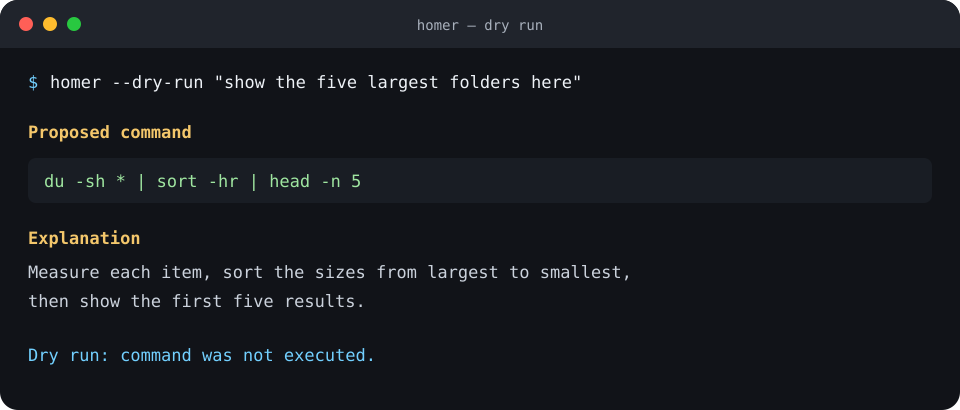

# Homer

[](https://github.com/pietroforni/homer/actions/workflows/ci.yml)
[](https://www.python.org/)
[](https://www.apple.com/macos/)
[](LICENSE)

Homer turns plain-English requests into reviewed shell commands using a model running locally
through [Ollama](https://ollama.com/). It shows the exact command and an explanation, checks the
syntax and risk level, and waits for your confirmation before running anything.



## Why Homer?

- **Local by default.** Requests go to Ollama on your Mac, not a hosted AI service.
- **Confirmation first.** Homer never runs a proposed command without an explicit `y`.
- **Conservative.** Malformed commands are rejected and high-risk patterns are always blocked.
- **Small.** One focused CLI, one local model connection, and no background process.

## Install

Homer requires macOS, Python 3.10 or newer, and [Ollama for macOS](https://ollama.com/download).
Start Ollama and download the default model:

```zsh
ollama pull qwen2.5:7b
```

Install Homer directly from GitHub with [uv](https://docs.astral.sh/uv/):

```zsh
uv tool install git+https://github.com/pietroforni/homer
```

Alternatively, use pipx:

```zsh
pipx install git+https://github.com/pietroforni/homer
```

Verify the setup:

```zsh
homer doctor
```

## Use

Ask for a command:

```zsh
homer "show the ten largest files in Downloads"
```

Preview without any possibility of execution:

```zsh
homer --dry-run "compress the Reports folder as a tar.gz archive"
```

Run `homer` without a request to enter an in-memory interactive session. Use `/exit`,
`Ctrl-C`, or `Ctrl-D` to leave.

### Optional writing mode

Homer also includes a secondary local writing assistant:

```zsh
homer write "Draft a short project update"
homer write --input article.md --output revised.md "Make this clearer"
homer write --style-guide ./my-style.md "Draft a concise introduction"
```

Writing mode uses a small packaged style guide unless you provide your own. It never replaces an
existing output file unless `--force` is supplied.

## Safety and privacy

Homer validates proposed commands with zsh and a conservative parser. Commands involving broad
deletion, privilege escalation, disk formatting, remote scripts piped into a shell, dynamic shell
evaluation, or similar high-risk behavior are blocked with no override.

Safety classification is a guardrail, not a proof. Read every command before confirming it. See
[the safety model](docs/safety.md) and [configuration reference](docs/configuration.md) for details.

## Develop

```zsh
git clone https://github.com/pietroforni/homer.git
cd homer
uv sync --group dev
uv run ruff check .
uv run pytest
uv build
```

The committed `uv.lock` keeps development and CI reproducible. Runtime dependencies remain
declared as compatible ranges in `pyproject.toml` for normal tool installation.

## License

[MIT](LICENSE)
