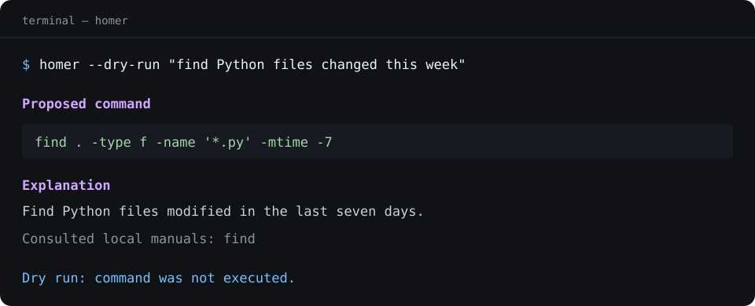
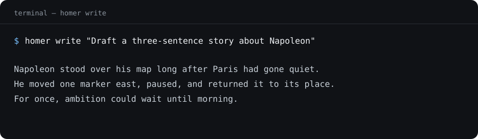

# Homer

Homer is a small side project I built for the moments when I know what I want the terminal to do,
but cannot remember the exact command. It asks a local Ollama model, shows me the command in plain
English, and leaves the final decision with me.

It is not trying to replace the shell. It is just a careful helper for getting from an intention
to a command I can inspect.



## How it works

Homer drafts one macOS shell command, consults the relevant manuals installed on your Mac, and asks
the local model to correct unsupported syntax. It then explains the result and checks its syntax
and risk level. Safe and caution-level commands still wait for `Execute? [y/N]`. Recognized
high-risk commands are blocked without an override.

The manual lookup and model requests stay on your machine. Homer has no cloud fallback, background
service, bundled manual snapshot, or saved prompt history.

## Install

You need macOS, Python 3.10 or newer, [uv](https://docs.astral.sh/uv/), and
[Ollama](https://ollama.com/download). Start Ollama and download the default model:

```zsh
ollama pull qwen2.5:7b
```

Install Homer from GitHub and check the setup:

```zsh
uv tool install git+https://github.com/pietroforni/homer
homer doctor
```

## Use

```zsh
homer "show the ten largest files in Downloads"
homer --dry-run "make a tar.gz archive of the Reports folder"
```

Use another installed Ollama model for a single request with `--model`:

```zsh
homer --model qwen2.5:3b "find JPEG files changed this week"
```

### A small writing helper

Writing is deliberately secondary, but useful for quick local drafts and edits:

```zsh
homer write "Draft a short project update"
homer write --input article.md --output revised.md "Make this clearer"
homer write --style-guide ./my-style.md "Draft a concise introduction"
```



Homer uses a simple built-in style guide unless you provide one. Existing output files are kept
unless you explicitly add `--force`.

## A note on safety

The checks are conservative guardrails, not proof that a generated command is harmless. Read the
command before typing `y`, check quoted paths, and use `--dry-run` whenever you are unsure. See
[SECURITY.md](SECURITY.md) for vulnerability reporting.

## Develop

```zsh
git clone https://github.com/pietroforni/homer.git
cd homer
uv sync --group dev
uv run ruff check .
uv run pytest
uv build
```

The project is tested on macOS with Python 3.10 and 3.14. Development dependencies are pinned in
`uv.lock`.

## License

[MIT](LICENSE)
